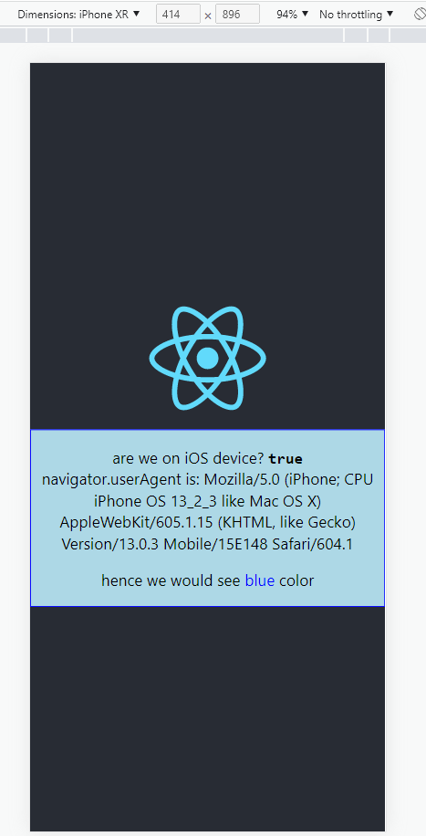
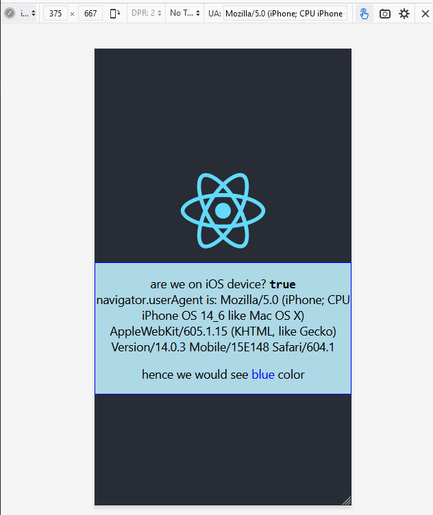
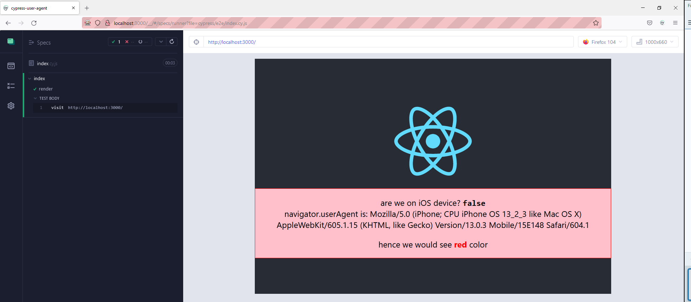

# User agent logic not working inside cypress tests

Details:

- we have a simple function that checks if the user is on an iOS device
- in case of an iOS device, blue message... else red message on the screen

### to run the project `yarn` & then `yarn start`

- we see that mobile emulator picks the iOS device in

| chrome                                         | firefox                                           |
| ---------------------------------------------- | ------------------------------------------------- |
|  |  |

### to run the cypress `yarn test:cyp`

- select "E2E Testing"
- select "Firefox v104"
- click "Start E2E Testing in Firefox"

## Problem:

- the logic works as intended on:
  - real iOS device
  - chrome emulator
  - firefox emulator
  - correct `navigator.userAgent` triggers the UI logic
- the logic doesn't work as expected inside cypress
  - even though `navigator.userAgent` is **correct**, UI logic is not triggered

